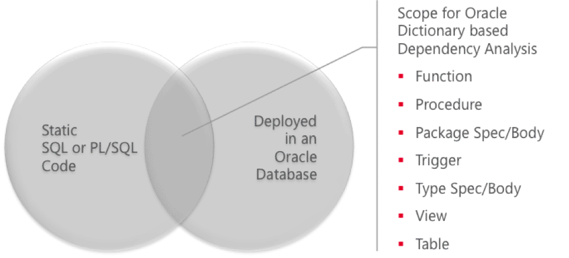
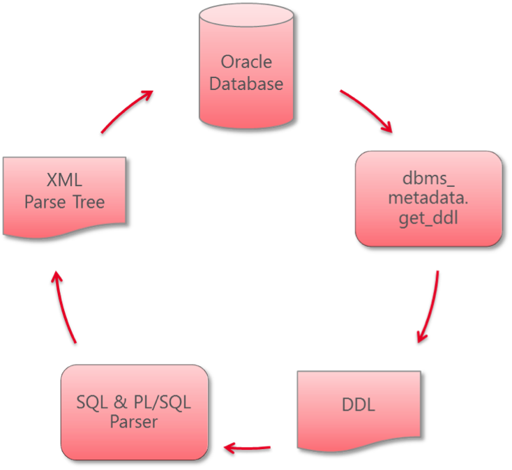

# PL/SQL Analyzer

## Introduction

Trivadis PL/SQL Analyzer is a command line utility to parse PL/SQL and SQL source code within an Oracle database and store the resulting XML parse-trees in dedicated relational tables – as an extension to the Oracle Data Dictionary – for further analysis.

Analysis is supported for static and dynamic code.

Sample analyses are provided as views and pipelined table functions, e.g.:

- `TVD_OBJECT_HINT_USAGE_V`: Used hints in static code.
- `TVD_OBJECT_USAGE_V`: Used tables/views in static code.
- `TVD_OBJECT_COL_USAGE_V`: Used columns in static code.
- `TVD_COLDEP_PKG`: View column dependencies.
- `TVD_SQL_HINT_USAGE_V`: Used hints in captures SQL statements.
- `TVD_SQL_USAGE_V`: Used tables/views in captured SQL statements.
- `TVD_SQL_COL_USAGE_V`: Used columns in captured SQL statements.

## Concepts

### Scope

The primary scope of PL/SQL Analyzer is the analysis of SQL and PL/SQL code within an Oracle database instance as shown in the following picture:



Please consider using standard tooling from Oracle before using PL/SQL Analyzer. Oracle provides in that area the following support:

- Oracle data dictionary views such as `DBA_DEPENDENCIES`, `DBA_SOURCE`, `DBA_PROCEDURES`, `DBA_ARGUMENTS`, `DBA_TYPES`, `DBA_TYPE_METHODS`, `DBA_TRIGGERS`, `DBA_VIEWS`, `DBA_TABLES`
- PL/Scope and its data dictionary views `DBA_IDENTIFIERS` and `DBA_STATEMENTS` (see also the free [plscope-utils for SQL Developer](https://www.salvis.com/blog/plscope-utils-for-sql-developer/))
- Oracle parser such as UTL_XML.PARSEQUERY (which is a good choice for SELECT statements without plsql_declarations in the [with_clause](http://docs.oracle.com/database/122/SQLRF/SELECT.htm#GUID-CFA006CA-6FF1-4972-821E-6996142A51C6__BABFAFID))

As soon as you need deeper information about SQL statements in your code, e.g. column usage in general or in certain clauses (e.g. in the select_list), PL/SQL Analyzer becomes appealing.

### Oracle Dictionary Extension for Static Code Analysis

PL/SQL Analyzer populates the following structure as an extension to the Oracle data dictionary for static analysis:

```
SQL> desc tvd_parsed_objects_v
 Name                               Null? Type
 ------------------------------- -------- ----------------------------
 OBJECT_ID                       NOT NULL NUMBER
 OWNER                           NOT NULL VARCHAR2(30 CHAR)
 OBJECT_NAME                     NOT NULL VARCHAR2(128 CHAR)
 OBJECT_TYPE                     NOT NULL VARCHAR2(30 CHAR)
 LAST_DDL_TIME                   NOT NULL DATE
 DDL_SOURCE                      NOT NULL CLOB
 PARSE_TREE                               SYS.XMLTYPE
 PARSE_ERRORS                             CLOB
```

The columns `OBJECT_ID`, `OWNER`, `OBJECT_NAME`, `OBJECT_TYPE` and `LAST_DDL_TIME` have the same semantic as the columns in the Oracle data dictionary view `DBA_OBJECTS`. The column `DDL_SOURCE` contains the result of a `DBMS_METADATA.GET_DDL` function call. The column `PARSE_TREE` contains the parse tree in XML format. The column `PARSE_ERRORS` contains error messages that occurred during parse or XML serialization. Errors may occur if the DDL contains invalid code; or the DDL contains control characters which may not be serialized in XML; or the Trivadis PL/SQL parser is not able to fully parse the code. However, a partial parse tree is created even if the Trivadis PL/SQL parser throws an error. In that case typically just the failing SQL statement is missing.

The following picture visualizes the population process of the view `tvd_parsed_objects_v`:



Just outdated rows in `DBA_OBJECTS` are processed (identified via column `LAST_DDL_TIME`).

### Oracle Dictionary Extension for Dynamic Code Analysis

As explained in chapter [Scope](#scope) PL/SQL Analyzer is primarily designed for static code analysis. However, it’s possible to analyze dynamic PL/SQL and SQL if the code is captured in the following structure:

```
SQL> desc tvd_captured_sql_t
 Name                            Null?    Type
 ------------------------------- -------- ----------------------------
 CAP_ID                          NOT NULL NUMBER
 CAP_SOURCE                      NOT NULL CLOB
 SQL_ID                                   VARCHAR2(13 CHAR)
 USER_NAME                                VARCHAR2(30 CHAR)
 SCHEMA_NAME                              VARCHAR2(30 CHAR)
 MODULE                                   VARCHAR2(64 CHAR)
 ACTION                                   VARCHAR2(64 CHAR)
 LAST_DDL_TIME                            DATE
 PARSE_TREE                               SYS.XMLTYPE
 PARSE_TREE_CLOB                          CLOB
 PARSE_ERRORS                             CLOB
```

The column `CAP_ID` is the primary key of the table and should be populated with a sequence value from `TVD_CAPTURED_SQL_SEQ` to avoid duplicated entries. The column `CAP_SOURCE` contains the captured SQL or PL/SQL statement. It does not matter how this structure is populated, it simply updates the columns `PARSE_TREE` and `PARSE_ERRORS` if the `PARSE_TREE` column `IS NULL` (`PARSE_TREE_CLOB` is a workaround for `XMLTYPE` bugs). All other columns are optional and may give the SQL a context.

The structure above could be populated on an Oracle instance as follows:

<details>
<summary>Click to expand/collapse</summary>
<p>

#### Sample Population of `tvd_captured_sql_t`

```sql
MERGE INTO tvd_captured_sql_t t
USING (SELECT a.sql_id,
              a.sql_fulltext        AS cap_source,
              u.username            AS user_name,
              a.parsing_schema_name AS schema_name,
              a.module,
              a.action,
              a.last_load_time
         FROM v$sqlarea a
        INNER JOIN all_users u
           ON a.parsing_user_id = u.user_id
        WHERE a.parsing_schema_name NOT IN
              ('ANONYMOUS',
               'APEX_PUBLIC_USER',
               'CTXSYS',
               'DBSNMP',
               'DIP',
               'EXFSYS',
               'FLOWS_FILES',
               'GSMADMIN_INTERNAL',
               'LBACSYS',
               'MDDATA',
               'MDSYS',
               'MGMT_VIEW',
               'OLAPSYS',
               'ORACLE_OCM',
               'ORDDATA',
               'ORDPLUGINS',
               'ORDSYS',
               'OUTLN',
               'OWBSYS',
               'SI_INFORMTN_SCHEMA',
               'SPATIAL_CSW_ADMIN_USR',
               'SPATIAL_WFS_ADMIN_USR',
               'SYS',
               'SYSMAN',
               'SYSTEM',
               'WKPROXY',
               'WKSYS',
               'WK_TEST',
               'WMSYS',
               'XDB',
               'XS$NULL')) s
ON (s.sql_id = t.sql_id)
WHEN MATCHED THEN
   UPDATE
      SET t.last_load_time = s.last_load_time
    WHERE t.last_load_time < s.last_load_time
WHEN NOT MATCHED THEN
   INSERT
      (t.cap_id,
       t.cap_source,
       t.sql_id,
       t.user_name,
       t.schema_name,
       t.module,
       t.action,
       t.last_load_time)
   VALUES
      (tvd_captured_sql_seq.nextval,
       s.cap_source,
       s.sql_id,
       s.user_name,
       s.schema_name,
       s.module,
       s.action,
       s.last_load_time)
```

</p>
</details>

Please note that the column `sql_fulltext` is not available in `v$sql_area` before version 11g Release 1 and that the SQL statement gathering process is not part of PL/SQL Analyzer.

## Custom Analysis

The sample analysis views and PL/SQL packages show you how the analysis based on the views tvd_parsed_objects_v and tvd_captured_sql_v could be done.

The idea is to query the relevant information from the XML parse tree using XQuery and present the result in a relational structure using the Oracle function XMLTABLE and do all further analysis in classic SQL based way.

It’s recommended to develop the XQuery using an XML editor supporting XQuery.

See XML schema documentation in the xsd directory. The complex type PLSQLFile is a good starting point in the HTML documentation.

## Releases

You find all releases and release information [here](https://github.com/Trivadis/plsql-analyzer/releases).

## Issues
Please file your bug reports, enhancement requests, questions and other support requests within [Github's issue tracker](https://help.github.com/articles/about-issues/).

* [Questions](https://github.com/trivadis/plsql-analyzer/issues?q=is%3Aissue+label%3Aquestion)
* [Open enhancements](https://github.com/trivadis/plsql-analyzer/issues?q=is%3Aopen+is%3Aissue+label%3Aenhancement)
* [Open bugs](https://github.com/trivadis/plsql-analyzer/issues?q=is%3Aopen+is%3Aissue+label%3Abug)
* [Submit new issue](https://github.com/trivadis/plsql-analyzer/issues/new)

## Frequently Asked Questions

see [Frequently Ased Questions](FAQ.md).

## License

The preview/trial version of PL/SQL Analyzer is licensed under the Creative Commons Attribution-NonCommercial-NoDerivs 3.0 Unported License. You may obtain a copy of the License at https://creativecommons.org/licenses/by-nc-nd/3.0/.


The trial/preview version provides full functionality but is limited in time and volume.

For production use a separate software license agreement is required.
